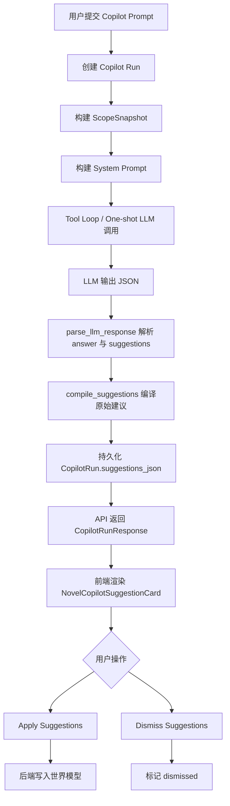

# Copilot Suggestions 生成机制技术文档

> 适用范围：NovelWriter Copilot 对话中的建议卡片（suggestions）生成、编译、展示、采纳与忽略流程。  
> 相关模块：`app/core/copilot/`、`app/api/copilot.py`、`app/schemas.py`、`web/src/components/novel-copilot/`。

---

## 1. 背景与目标

Copilot 的一次对话运行（run）不仅可以返回自然语言回答，还可以返回一组结构化建议（`suggestions`）。这些建议会在前端以卡片形式展示，用户可以：

- 查看建议标题、摘要与依据数量；
- 展开查看字段变更预览；
- 定位到对应世界模型对象；
- 采纳可直接应用的建议；
- 忽略不需要的建议。

Suggestions 的核心目标是把 LLM 的研究结论转化为**可审核、可选择、可应用**的世界模型编辑建议，而不是让模型直接修改数据。

---

## 2. 总体链路



核心原则：

1. LLM 只产出结构化建议草案；
2. 后端必须重新校验、编译并生成可应用动作；
3. 前端只展示后端编译后的建议；
4. 用户明确采纳后才真正修改世界模型。

---

## 3. 关键文件速览

| 层级 | 文件 | 作用 |
|---|---|---|
| Prompt | `app/core/copilot/prompting.py` | 约束 LLM 何时输出 suggestions，以及 suggestions JSON 结构 |
| Tool Loop | `app/core/copilot/tool_loop.py` | 执行带工具调用的研究循环，获得最终 LLM 响应 |
| 编排 | `app/core/copilot/__init__.py` | 创建 run、调用 tool loop、编译 suggestions、持久化结果 |
| 编译 | `app/core/copilot/suggestions.py` | 将 LLM 原始 suggestions 编译为后端可信建议卡 |
| 应用 | `app/core/copilot/apply.py` | 执行用户采纳的建议，写入实体/关系/体系 |
| 持久化 | `app/core/copilot/run_store.py` | 保存 run 的 answer、evidence、suggestions、trace |
| Schema | `app/schemas.py` | 定义 CopilotRunResponse 与 CopilotSuggestionResponse 等 API 契约 |
| API | `app/api/copilot.py` | 提供 run 创建、轮询、apply、dismiss 等 HTTP 接口 |
| 前端类型 | `web/src/types/copilot.ts` | CopilotSuggestion、target、preview、apply action 类型 |
| 前端 API | `web/src/services/copilotApi.ts` | 解析后端 suggestions 响应 |
| 前端状态 | `web/src/hooks/novel-copilot/useNovelCopilotRuns.ts` | 管理 run 轮询、apply、dismiss 与缓存刷新 |
| 前端展示 | `web/src/components/novel-copilot/NovelCopilotSuggestionCard.tsx` | 渲染建议卡、变更预览、定位/采纳/忽略按钮 |
| Drawer | `web/src/components/novel-copilot/NovelCopilotDrawer.tsx` | 汇总显示 pending/applied suggestions |

---

## 4. LLM 输出格式约束

Suggestions 的第一步来自 Prompt 约束。核心文件：

```text
app/core/copilot/prompting.py
```

Copilot 要求模型最终输出 JSON，大致结构如下：

```json
{
  "answer": "自然语言分析/回答",
  "cited_evidence_indices": [0, 1],
  "suggestions": [
    {
      "kind": "update_entity | create_entity | update_relationship | create_relationship | update_system | create_system",
      "title": "建议标题",
      "summary": "一句话说明",
      "cited_evidence_indices": [0],
      "target_resource": "entity | relationship | system",
      "target_id": 123,
      "delta": {
        "name": "可选",
        "entity_type": "可选",
        "description": "可选",
        "aliases": ["可选"],
        "label": "可选，relationship",
        "source_id": "可选，relationship create",
        "target_id": "可选，relationship create",
        "source_name": "可选，relationship create；新实体名",
        "target_name": "可选，relationship create；新实体名",
        "source_entity_type": "可选，新 source 实体类型",
        "target_entity_type": "可选，新 target 实体类型",
        "constraints": ["可选，system"],
        "display_type": "可选，system",
        "attributes": [
          { "key": "属性名", "surface": "可见值" }
        ]
      }
    }
  ]
}
```

### 4.1 输出规则

Prompt 中对 suggestions 有明确规则：

1. 只能基于工具返回的证据提出建议，不能编造；
2. 没有 suggestions 是正常结果；
3. 闲聊或能力询问轮次默认不生成 suggestions；
4. `target_id` 必须引用已知实体、关系或体系 ID；
5. `delta` 只包含需要修改或新增的字段；
6. 不建议删除、合并或拆分；
7. `attributes` 用于建议新增或更新实体属性；
8. 如果 `create_relationship` 涉及尚不存在的新实体，必须同时生成对应的 `create_entity` 建议，并在关系 `delta` 中填写 `source_name` / `target_name`。

---

## 5. 场景对 suggestions 的影响

Copilot 根据当前场景调整 suggestions 策略。主要约束位于：

```text
app/core/copilot/prompting.py
```

### 5.1 whole_book：全书研究

特点：

- 默认以分析和证据为主；
- 只有当证据充分支撑具体修改时，才输出 suggestions；
- 没有 suggestions 是正常结果。

适合生成：

- 缺失实体建议；
- 缺失关系建议；
- 体系或规则补充建议；
- 有明确证据的设定修正建议。

### 5.2 current_entity：当前实体补完

特点：

- 围绕目标实体补完和核查；
- 关注类别、别名、描述、属性、约束、关系线索；
- 优先生成实体补全建议。

适合生成：

- `update_entity`；
- `create_relationship`；
- 与当前实体直接相关的 `create_entity`。

### 5.3 relationships：关系梳理

特点：

- 围绕中心实体梳理关系网络；
- 关注缺失连接、关系标签统一、互动证据、关系描述补全；
- suggestions 应以 `update_relationship` 或 `create_relationship` 为主。

适合生成：

- `update_relationship`；
- `create_relationship`；
- 为新关系端点补充 `create_entity`。

### 5.4 draft_cleanup：草稿整理

特点：

- 只整理已有草稿行；
- 关注命名统一、字段补全、弱候选标记；
- 只能做非破坏性的局部编辑；
- `target_id` 必须指向草稿行 ID；
- 不允许 `create_entity`。

适合生成：

- 对 draft entity 的 `update_entity`；
- 对 draft relationship 的 `update_relationship`；
- 对 draft system 的 `update_system`。

---

## 6. Run 编排与 suggestions 编译入口

核心文件：

```text
app/core/copilot/__init__.py
```

一次 Copilot run 的后端主流程可以概括为：

1. 创建 `CopilotRun`；
2. 构建初始 `ScopeSnapshot`；
3. 调用 tool loop；
4. 解析 LLM 最终 JSON；
5. 使用新快照编译 suggestions；
6. 持久化完成结果。

关键逻辑：

```py
parsed, final_evidence, workspace = await _run_tool_loop(...)

fresh_snapshot = load_scope_snapshot(...)

compiled = compile_suggestions(
    parsed.get("suggestions", []) if _should_preload_world_context(turn_intent) else [],
    final_evidence,
    fresh_snapshot,
    session_data["mode"],
    scenario,
    interaction_locale=session_data["interaction_locale"],
)

_persist_completed_run(
    ...,
    answer=parsed.get("answer", ""),
    evidence=final_evidence,
    compiled_suggestions=compiled,
    ...,
)
```

### 6.1 为什么使用 fresh snapshot

LLM 生成建议时，世界模型可能已被其他操作修改。编译阶段重新加载 `fresh_snapshot`，用于：

- 校验目标对象是否仍然存在；
- 校验目标对象是否仍是草稿；
- 计算字段变更前后值；
- 避免把 stale suggestion 标记为可直接应用。

---

## 7. Suggestion 编译器

核心文件：

```text
app/core/copilot/suggestions.py
```

核心函数：

```py
compile_suggestions(
    raw_suggestions: list[dict[str, Any]],
    evidence: list[EvidenceItem],
    snapshot: ScopeSnapshot,
    mode: str,
    scenario: str,
    interaction_locale: str = "zh",
) -> list[CompiledSuggestion]
```

### 7.1 编译前限制

```py
MAX_COMPILED_SUGGESTIONS = 20
```

单轮最多编译 20 条建议，避免前端和用户审核负担过重。

### 7.2 编译后的结构

后端内部结构：

```py
@dataclass
class CompiledSuggestion:
    suggestion_id: str
    kind: str
    title: str
    summary: str
    evidence_ids: list[str]
    target: dict[str, Any]
    preview: dict[str, Any]
    apply_action: dict[str, Any] | None
    status: str = "pending"
```

其中：

- `suggestion_id`：后端生成的稳定建议 ID；
- `kind`：建议类型，例如 `update_entity`；
- `evidence_ids`：映射到后端证据 ID；
- `target`：前端定位目标；
- `preview`：前端展示变更预览；
- `apply_action`：用户采纳时执行的动作；
- `status`：`pending` / `applied` / `dismissed`。

### 7.3 编译步骤

`compile_suggestions()` 主要做以下事情：

1. 截断超过上限的 raw suggestions；
2. 对关系建议补齐缺失实体依赖；
3. 为每条建议生成 `suggestion_id`；
4. 调用 `_compile_one()` 编译单条建议；
5. 捕获单条编译异常，避免一条坏建议影响整轮结果。

伪代码：

```py
limited = raw_suggestions[:MAX_COMPILED_SUGGESTIONS]
expanded = _expand_relationship_entity_dependencies(limited, snapshot, interaction_locale)
suggestion_ids = [generate_id() for each expanded]

for raw in expanded:
    try:
        compiled.append(_compile_one(...))
    except Exception:
        logger.debug("Failed to compile suggestion")
```

---

## 8. 单条建议编译规则

核心函数：

```py
_compile_one(...)
```

### 8.1 update 类建议

当 `kind.startswith("update_")` 时：

1. 使用 `target_resource` 和 `target_id` 解析目标；
2. 如果目标不存在，标记为不可应用；
3. 如果是草稿治理模式但目标不是 draft，标记为不可应用；
4. 调用 `_build_update_action()` 生成 apply action；
5. 调用 `_build_field_deltas()` 生成前端变更预览。

典型输出：

```json
{
  "type": "update_entity",
  "entity_id": 123,
  "data": {
    "description": "新的描述"
  }
}
```

### 8.2 create 类建议

当 `kind.startswith("create_")` 时：

1. 草稿治理模式下禁止 create，标记为不可应用；
2. 根据 `delta` 构建新资源 label；
3. 调用 `_build_create_action()` 生成 apply action；
4. 如果必要字段不完整，标记为不可应用。

典型输出：

```json
{
  "type": "create_entity",
  "data": {
    "name": "青岚宗",
    "entity_type": "Organization",
    "description": "反复出现的宗门势力"
  }
}
```

### 8.3 不支持的 kind

如果 `kind` 既不是 `update_` 也不是 `create_`，则：

- `preview.actionable = false`；
- `apply_action = null`；
- 前端展示为“仅供参考”。

---

## 9. Evidence 映射

LLM 输出使用 `cited_evidence_indices` 引用证据索引，例如：

```json
"cited_evidence_indices": [0, 2]
```

编译器会将其转换为真实 evidence ID：

```py
evidence_ids = [
    evidence[idx].evidence_id
    for idx in cited
    if isinstance(idx, int) and 0 <= idx < len(evidence)
]
```

同时会抽取最多 3 条证据片段作为前端预览：

```py
evidence_quotes = [evidence[idx].excerpt[:200] ...][:3]
```

前端展示时：

- 卡片上显示证据数量；
- 展开后显示关键证据摘录；
- evidence pack 仍可通过 run evidence 区域查看。

---

## 10. Preview 与 Field Delta

每条建议都会生成 `preview`：

```json
{
  "target_label": "苏瑶",
  "summary": "补充苏瑶与宗门的关联描述",
  "field_deltas": [
    {
      "field": "description",
      "label": "描述",
      "before": "旧描述",
      "after": "新描述"
    }
  ],
  "evidence_quotes": ["章节证据片段"],
  "actionable": true,
  "non_actionable_reason": null
}
```

前端 `NovelCopilotSuggestionCard.tsx` 根据 `preview` 展示：

- 目标对象；
- 字段名；
- 原值；
- 新值；
- 关键证据；
- 是否可直接采纳。

`preview.actionable = false` 时：

- 采纳按钮禁用；
- 显示 `non_actionable_reason`；
- 建议仍可作为参考保留。

---

## 11. API 数据契约

核心文件：

```text
app/schemas.py
```

### 11.1 CopilotRunResponse

```py
class CopilotRunResponse(BaseModel):
    run_id: str
    status: str
    prompt: str
    answer: Optional[str] = None
    trace: List[CopilotTraceStepResponse] = Field(default_factory=list)
    evidence: List[CopilotEvidenceResponse] = Field(default_factory=list)
    suggestions: List[CopilotSuggestionResponse] = Field(default_factory=list)
    error: Optional[str] = None
```

### 11.2 CopilotSuggestionResponse

```py
class CopilotSuggestionResponse(BaseModel):
    suggestion_id: str
    kind: str
    title: str
    summary: str
    evidence_ids: List[str] = Field(default_factory=list)
    target: CopilotSuggestionTargetResponse
    preview: CopilotSuggestionPreviewResponse
    apply: Optional[CopilotApplyActionResponse] = None
    status: str
```

### 11.3 Target

```py
class CopilotSuggestionTargetResponse(BaseModel):
    resource: Literal["entity", "relationship", "system"]
    resource_id: Optional[int] = None
    label: str
    tab: str
    entity_id: Optional[int] = None
    review_kind: Optional[str] = None
    highlight_id: Optional[int] = None
```

`target` 用于前端“定位”按钮，帮助用户跳转到对应 Atlas 或 Studio 区域。

### 11.4 Apply Action

```py
class CopilotApplyActionResponse(BaseModel):
    type: str
    entity_id: Optional[int] = None
    relationship_id: Optional[int] = None
    system_id: Optional[int] = None
    data: dict = Field(default_factory=dict)
```

`apply` 为 `null` 时表示仅供参考，不能直接采纳。

---

## 12. 持久化

核心文件：

```text
app/core/copilot/run_store.py
```

完成 run 后保存：

```py
store_run.answer = answer
store_run.evidence_json = [serialize_evidence(item) for item in evidence]
store_run.suggestions_json = serialize_compiled_suggestions(compiled_suggestions)
store_run.trace_json = build_completed_trace(...)
```

`CopilotRun.suggestions_json` 是前端轮询结果中 suggestions 的来源。

---

## 13. Apply / Dismiss 流程

### 13.1 Apply

核心文件：

```text
app/core/copilot/apply.py
app/api/copilot.py
web/src/hooks/novel-copilot/useNovelCopilotRuns.ts
```

用户点击“采纳”后：

1. 前端调用 `applySuggestions(sessionId, runId, [suggestionId])`；
2. API 找到对应 run；
3. 后端读取 `suggestions_json`；
4. 校验 suggestion 是否存在、是否 pending、是否 actionable；
5. 根据 `apply.type` 执行实体/关系/体系创建或更新；
6. 将 suggestion 状态改为 `applied`；
7. 返回每条 suggestion 的执行结果；
8. 前端刷新 run 和世界模型缓存。

支持的动作包括：

- `create_entity`
- `update_entity`
- `create_relationship`
- `update_relationship`
- `create_system`
- `update_system`

### 13.2 Dismiss

用户点击“忽略”后：

1. 前端调用 `dismissSuggestions(sessionId, runId, [suggestionId])`；
2. 后端将对应 suggestion 状态改为 `dismissed`；
3. 前端从待处理列表中移除该建议。

Dismiss 不修改世界模型。

---

## 14. 前端展示模型

核心类型定义：

```text
web/src/types/copilot.ts
```

```ts
export interface CopilotSuggestion {
  suggestion_id: string
  kind: string
  title: string
  summary: string
  evidence_ids: string[]
  target: CopilotSuggestionTarget
  preview: CopilotSuggestionPreview
  apply: CopilotSuggestionApplyAction | null
  status: 'pending' | 'applied' | 'dismissed'
}
```

### 14.1 Suggestion Card

核心文件：

```text
web/src/components/novel-copilot/NovelCopilotSuggestionCard.tsx
```

卡片展示内容：

- 类型 chip：实体 / 关系 / 体系；
- 证据数量；
- 可直接采纳 / 仅供参考；
- 标题与摘要；
- 字段变更预览；
- 关键证据摘录；
- 定位按钮；
- 忽略按钮；
- 采纳按钮。

### 14.2 Drawer 汇总

核心文件：

```text
web/src/components/novel-copilot/NovelCopilotDrawer.tsx
```

Drawer 负责将 run 中的 suggestions 分为：

- pending suggestions：待处理建议；
- applied suggestions：已采纳建议；
- dismissed suggestions：通常不再展示在待处理区。

---

## 15. 常见问题排查

### 15.1 LLM 明明回答了建议，但前端没有建议卡

优先检查：

1. LLM 是否输出合法 JSON；
2. `parse_llm_response()` 是否成功解析；
3. JSON 中是否有 `suggestions` 字段；
4. 当前 turn 是否允许 suggestions：`_should_preload_world_context(turn_intent)`；
5. `compile_suggestions()` 是否把建议过滤掉；
6. `suggestions_json` 是否持久化；
7. API `CopilotRunResponse.suggestions` 是否返回非空；
8. 前端 `copilotApi.ts` 是否解析成功。

### 15.2 建议卡显示“仅供参考”

常见原因：

- 目标对象不存在或已变化；
- update 建议缺少有效 `target_id`；
- create 建议缺少必要字段；
- draft_cleanup 模式中试图创建新对象；
- draft_cleanup 模式中目标不是 draft；
- `kind` 不在支持范围内；
- `_build_update_action()` 或 `_build_create_action()` 返回 `None`。

### 15.3 采纳失败

常见原因：

- suggestion 已被采纳或忽略；
- suggestion 已失效；
- 目标实体/关系/体系被删除；
- `apply` 为 `null`；
- 后端 `apply.py` 不支持该 action type；
- 数据库校验失败。

---

## 16. 扩展一种新的 suggestion 类型

假设要新增 `mark_weak_candidate`，建议修改顺序如下：

### 16.1 Prompt 层

文件：

```text
app/core/copilot/prompting.py
```

需要：

- 在输出 JSON 示例中加入新的 `kind`；
- 明确该 kind 何时使用；
- 说明 `delta` 必填字段；
- 补充场景约束，尤其是 draft_cleanup。

### 16.2 编译层

文件：

```text
app/core/copilot/suggestions.py
```

需要：

- 在 `_compile_one()` 或相关 helper 中识别新 kind；
- 生成正确的 `target`；
- 生成 `preview.field_deltas`；
- 生成 `apply_action`；
- 明确不可应用原因。

### 16.3 应用层

文件：

```text
app/core/copilot/apply.py
```

需要：

- 增加 action type 分支；
- 执行数据库更新；
- 处理 stale target；
- 返回 ApplyResult。

### 16.4 Schema 层

文件：

```text
app/schemas.py
web/src/types/copilot.ts
web/src/services/copilotApi.ts
```

如果新增字段或 action 结构，需要同步更新：

- 后端 response schema；
- 前端 TypeScript 类型；
- 前端 API parser。

### 16.5 UI 层

文件：

```text
web/src/components/novel-copilot/novelCopilotView.ts
web/src/components/novel-copilot/NovelCopilotSuggestionCard.tsx
web/src/lib/uiMessagePacks/copilot.ts
```

需要：

- 增加 kind 展示文案；
- 增加 chip 样式或类型映射；
- 如有特殊预览需求，调整卡片 UI；
- 增加中英文文案。

### 16.6 测试层

建议增加：

- `compile_suggestions()` 单元测试；
- `apply_suggestions()` 单元测试；
- 前端 suggestion card 渲染测试；
- API apply/dismiss 集成测试。

---

## 17. 设计约束与最佳实践

1. **不要让 LLM 直接写库**  
   LLM 只生成建议，用户采纳后由后端确定性逻辑写库。

2. **建议必须可追溯到证据**  
   `cited_evidence_indices` 必须引用已有 evidence，不能编造。

3. **编译阶段必须重新校验目标**  
   使用 fresh snapshot 防止 stale edit。

4. **草稿整理模式要更保守**  
   draft_cleanup 只能整理现有 draft，不应创建新对象。

5. **不可应用也可以有价值**  
   `actionable = false` 的建议仍可作为参考，但不能让用户直接采纳。

6. **新增建议类型时必须端到端修改**  
   Prompt、compiler、apply、schema、frontend parser、UI 文案通常都需要同步更新。

7. **建议数量要控制**  
   当前上限是 20 条，实际产品体验中应鼓励少量高价值建议。

---

## 18. 推荐阅读顺序

如果要深入理解 Copilot Suggestions，建议按以下顺序读源码：

1. `web/src/components/novel-copilot/NovelCopilotSuggestionCard.tsx`  
   先看用户最终看到什么。

2. `web/src/types/copilot.ts`  
   理解前端期望的数据结构。

3. `app/schemas.py`  
   对照后端 API 契约。

4. `app/core/copilot/prompting.py`  
   理解 LLM 为什么会输出 suggestions。

5. `app/core/copilot/tool_loop.py`  
   理解模型如何检索证据并形成最终回答。

6. `app/core/copilot/__init__.py`  
   理解 run 生命周期和 suggestions 编译入口。

7. `app/core/copilot/suggestions.py`  
   深入编译、校验、preview、apply action 生成。

8. `app/core/copilot/apply.py`  
   理解采纳建议如何写入世界模型。

9. `web/src/hooks/novel-copilot/useNovelCopilotRuns.ts`  
   理解前端如何轮询、采纳、忽略并刷新缓存。

---

## 19. 一句话总结

Copilot Suggestions 是一条从 **Prompt 约束 LLM 输出结构化建议**，到 **后端编译校验生成可应用动作**，再到 **前端建议卡审核与用户采纳** 的端到端闭环；其核心安全边界在 `suggestions.py` 和 `apply.py`，核心生成质量取决于 `prompting.py` 和 tool loop 收集到的 evidence。
