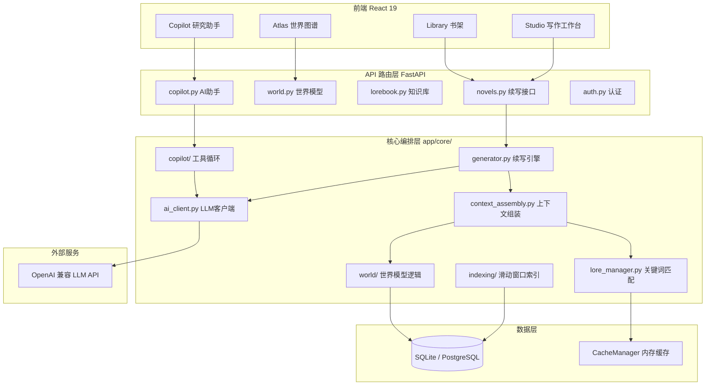
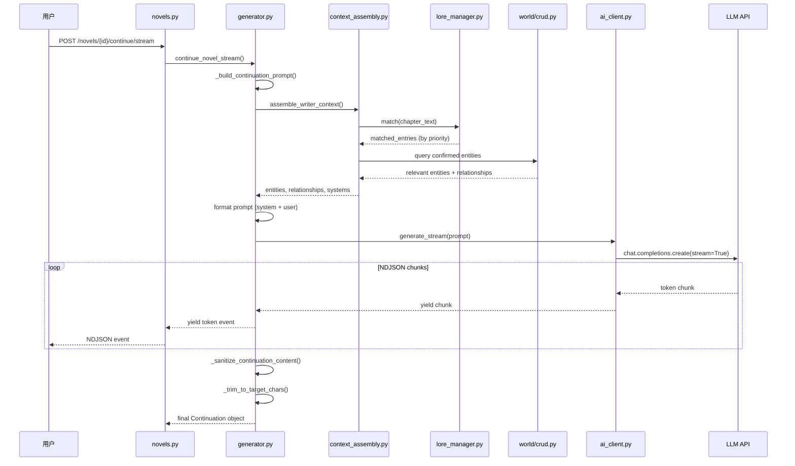
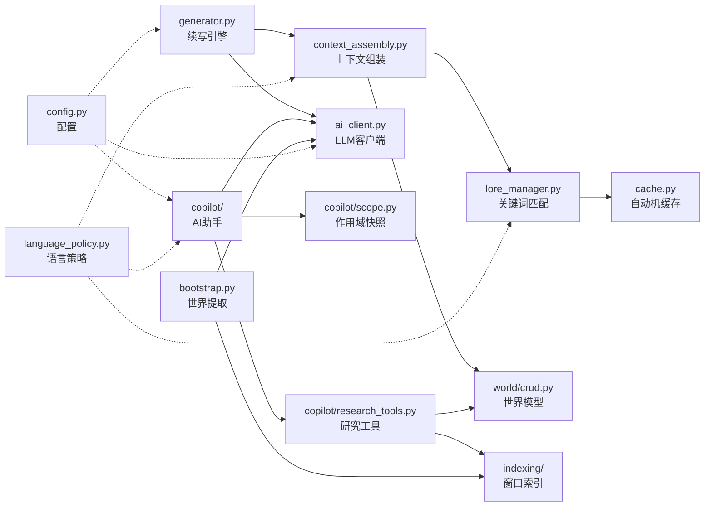

# NovelWriter 高级学习指南

> 生成时间：2026-05-01
> 项目：NovelWriter (NovWr) — AI 驱动的长篇小说写作引擎
> 目标读者：Advanced（面向有 FastAPI / React 经验的开发者）

---

## 目录

- [项目概述](#项目概述)
- [快速开始](#快速开始)
- [核心架构](#核心架构)
- [核心模块拆解](#核心模块拆解)
- [技术栈分析](#技术栈分析)
- [设计理念](#设计理念)
- [核心概念](#核心概念)
- [典型使用场景](#典型使用场景)
- [最佳实践与常见陷阱](#最佳实践与常见陷阱)
- [学习路径建议](#学习路径建议)
- [源码阅读目标问题清单](#源码阅读目标问题清单)
- [参考资源](#参考资源)
- [总结](#总结)

---

## 项目概述

### 项目简介

NovelWriter（内部代号 SCNGS）是一个长篇小说 AI 续写引擎，核心价值在于通过**世界模型驱动的上下文注入**维持长篇叙事的一致性。系统由 FastAPI 后端和 React 19 前端组成，支持多语言文本处理（zh/en/ja/ko），并提供 AI Copilot 作为作者的研究助手。

### 解决的问题

传统 AI 文本生成在长篇小说场景中面临**上下文遗忘**和**世界观漂移**两大核心问题。NovelWriter 通过以下机制系统性地解决它们：

1. **Lorebook 关键词注入** — Aho-Corasick 自动机实时匹配章节文本中的实体关键词，按优先级注入上下文
2. **World Model 实体图谱** — 维护结构化的实体、属性、关系、系统，基于相关性门控动态注入
3. **滑动窗口索引** — 对近期章节构建倒排索引，实现 O(1) 实体检索和共现分析
4. **Copilot 工具循环** — Agent 架构的研究助手，可自主调用 read/find/open 工具深度研究小说世界

### 适用场景

- 网文作者需要 AI 辅助续写，且要求人物性格、势力关系、世界观规则前后一致
- 自托管部署（selfhost 模式），单用户使用 BYOK（Bring Your Own Key）接入 LLM
- 多租户 SaaS 部署（hosted 模式），含配额管理、GitHub OAuth、服务端 LLM 代理

### 高级读者先知道什么

- 本质是一个**上下文工程系统**：所有核心模块都在解决「给 LLM 什么上下文」的问题
- 后端代码量远大于前端；学习重点应放在 `app/core/` 的生成管线和世界模型
- Copilot 子系统（`app/core/copilot/`）是代码量最大、抽象最密集的模块，建议最后深入

---

## 快速开始

### 环境要求

- Python 3.13+，包管理器 `uv`（版本锁定在 `pyproject.toml`）
- Node.js 18+（前端开发）
- 一个 OpenAI 兼容的 LLM API Key（支持 DeepSeek / OpenAI / 任意兼容端点）

### 安装与运行

```bash
# 后端
scripts/setup_python_env.sh
cp .env.example .env  # 编辑 .env 填入 OPENAI_API_KEY
scripts/uv_run.sh uvicorn app.main:app --reload --port 8000

# 前端
cd web && npm install && npm run dev  # http://localhost:5173

# 或 Docker 一键启动
docker compose up -d  # http://localhost:8000
```

### 首次运行观察点

- `GET /api/health` 返回 `{"status": "healthy", "db_connected": true}` 表示数据库就绪
- 日志中出现 `SCNGS started` 表示 lifespan 初始化完成
- selfhost 模式下 CORS 默认跳过（仅允许 localhost:5173）

---

## 核心架构

### 整体架构说明

系统采用经典的三层架构，但核心创新在于**上下文编排层**：

```
用户请求 → API 路由层 → 上下文编排层 → LLM 客户端 → 后处理 → 响应
                          ↑
            LoreManager + WorldModel + WindowIndex
```

**上下文编排层**是整个系统的灵魂。它负责从多个数据源（近期章节、Lorebook、世界模型）收集、过滤、排序上下文片段，组装成最终的 LLM prompt。

### 架构图



### 续写生成数据流



### 架构理解要点

1. **双轨上下文注入**：Lorebook（关键词触发）和 World Model（实体相关性门控）是两套独立的上下文来源，在 `generator.py` 中合并
2. **流式优先**：续写接口同时提供 `continue_novel`（同步）和 `continue_novel_stream`（NDJSON 流式），前端使用流式版本
3. **Copilot 异步作业模型**：Copilot 运行采用 `create run → poll status → get result` 的异步模式，后端通过 lease 机制管理并发
4. **语言感知贯穿始终**：从 `Novel.language` 到 `LanguagePolicy` 到 `PromptKey` 的 locale 参数，语言处理渗透在每一层

---

## 核心模块拆解

| 模块/子系统 | 主要职责 | 为什么重要 | 关键文件 | 阅读优先级 |
|---|---|---|---|---|
| **生成引擎** | 编排续写全流程：prompt 构建 → LLM 调用 → 后处理 | 系统核心价值所在 | `core/generator.py` | 高 |
| **上下文组装** | 合并章节文本 + Lorebook + World Model 为 LLM 上下文 | 所有上下文策略的汇聚点 | `core/context_assembly.py` | 高 |
| **AI 客户端** | 封装 OpenAI SDK，支持流式/非流式/结构化输出/tool call | 唯一的 LLM 通信层 | `core/ai_client.py` | 高 |
| **Lore Manager** | Aho-Corasick 自动机关键词匹配，优先级排序注入 | 上下文一致性的核心机制 | `core/lore_manager.py` | 高 |
| **Copilot 系统** | 工具循环 Agent：scope 快照 → 工具调度 → 证据收集 → 回答生成 | 系统中最复杂的子系统 | `core/copilot/` (12+ 文件) | 中 |
| **World Model** | 实体/属性/关系/系统的 CRUD + LLM 生成 + Worldpack 导入 | 结构化世界知识的持久层 | `core/world/` | 中 |
| **滑动窗口索引** | 对近期章节构建实体倒排索引（msgpack 序列化） | Copilot 搜索性能的基础 | `core/indexing/` | 中 |
| **Bootstrap** | 从原始文本通过 LLM 批量提取实体和关系 | 世界模型冷启动的关键路径 | `core/bootstrap.py` | 低 |
| **语言系统** | 语言检测、规范化、策略模式（CJK 分词/匹配规则） | 多语言支持的基础设施 | `language.py`, `language_policy.py` | 低 |
| **配置系统** | Pydantic Settings，双部署模式，安全验证 | 理解系统行为差异的关键 | `config.py` | 低 |

### 模块关系图



### 重点模块深入理解

#### 1. generator.py — 续写引擎

- **核心职责**：编排续写生成的完整生命周期
- **入口函数**：`continue_novel()` / `continue_novel_stream()`
- **内部流程**：`_build_continuation_prompt()` → `ai_client.generate()` / `generate_stream()` → `_sanitize_continuation_content()` → `_trim_to_target_chars()`
- **关键抽象**：
  - `PromptKey` 枚举驱动多语言 prompt 模板选择
  - `target_chars` 参数触发基于字符数的截断（而非 token）
  - `_THINK_BLOCK_RE` 正则清洗 LLM 输出中的思维链残留
- **为什么先学它**：这是整个系统的入口点，理解它就理解了数据流向

#### 2. context_assembly.py — 上下文组装

- **核心职责**：从多个异构数据源收集上下文，按策略合并
- **关键函数**：
  - `assemble_writer_context()` — 续写场景，visibility 门控（hidden 排除）
  - `assemble_checker_context()` — 审校场景，包含 hidden + truth 数据
- **Aho-Corasick 实体发现**：`_find_relevant_entities()` 使用 `pyahocorasick` 在章节文本中匹配世界模型实体关键词，构建相关性 ID 集合
- **歧义关键词处理**：当多个实体共享相同关键词时，系统将其标记为 ambiguous 并禁用自动匹配
- **为什么重要**：这是上下文工程策略的具象化，决定了 LLM 能「看到」什么

#### 3. ai_client.py — LLM 客户端

- **核心职责**：统一的 LLM 通信接口，屏蔽不同 provider 的差异
- **四种调用模式**：
  - `generate()` — 标准 chat completion
  - `generate_stream()` — 流式 SSE，NDJSON 事件
  - `generate_structured()` — 结构化输出（用于 World 生成、Bootstrap）
  - `generate_with_tools()` — tool call 模式（用于 Copilot）
- **关键设计**：
  - `_resolve_config()` 三级配置降级：请求参数 → hosted 服务端配置 → 用户设置
  - `stream_options={"include_usage": True}` 带降级重试（部分 provider 不支持）
  - 信号量 `max_concurrent_llm_calls` 控制并发上限
  - 配额预约模式：`reserve_quota` → generate → `charge`/`refund`

#### 4. lore_manager.py — Lorebook 关键词引擎

- **核心职责**：O(M) 时间复杂度的多模式字符串匹配
- **数据结构**：
  - `_automaton` — 大小写不敏感的 Aho-Corasick 自动机
  - `_automaton_sensitive` — 大小写敏感的专用自动机
  - `_regex_patterns` — 正则表达式匹配列表
- **匹配流程**：`build_automaton(db)` → `match(text)` → 按 priority 排序返回
- **语言策略感知**：通过 `LanguagePolicy.normalize_for_matching()` 处理 CJK 字符
- **缓存机制**：`CacheManager` 单例缓存已构建的自动机，`invalidate_novel()` 清除

#### 5. copilot/ — Copilot 子系统

这是项目中最复杂的模块，包含 12+ 文件：

| 子模块 | 职责 |
|---|---|
| `tool_loop.py` | Agent 循环编排器：LLM 调用 → tool dispatch → 结果注入 → 下一轮 |
| `research_tools.py` | 工具定义：`find`, `open`, `read`, `load_scope_snapshot` |
| `scope.py` | `ScopeSnapshot` — 小说世界状态的不可变快照 |
| `workspace.py` | `Workspace` — 运行时状态（消息历史、证据包、工具日志） |
| `prompting.py` | 系统提示词构建（800+ 行），含意图分类和快捷动作 |
| `suggestions.py` | 将 Copilot 回答编译为可操作的编辑建议 |
| `run_store.py` | 持久化运行状态、lease 管理 |
| `tracing.py` | 工具调用审计日志 |
| `apply.py` | 将建议应用到世界模型 |
| `messages.py` | 多语言 UI 消息 |

- **工具循环核心**：`run_tool_loop()` 接收 `ToolLoopDeps` 依赖注入，循环执行 `LLM → parse tool_calls → dispatch → inject results`，最多 `copilot_max_tool_rounds` 轮
- **ScopeSnapshot**：在运行开始时从 DB 加载的不可变世界状态快照，包含 entities、relationships、systems、drafts
- **证据包（EvidencePack）**：工具返回的结构化证据，带 `pack_id` 用于渐进式披露

---

## 技术栈分析

| 技术 / 框架 | 用途 | 出现位置 | 为什么重要 |
|---|---|---|---|
| **FastAPI** | 后端 Web 框架 | `app/main.py`, `app/api/` | 异步原生，自动 OpenAPI 文档 |
| **SQLAlchemy 2.x** | ORM | `app/models.py`, `app/database.py` | 声明式模型，支持 SQLite/PostgreSQL 双引擎 |
| **Pydantic v2** | 配置和校验 | `app/config.py`, `app/schemas.py` | Settings 模式实现 .env 到类型安全配置 |
| **OpenAI Python SDK** | LLM 通信 | `app/core/ai_client.py` | AsyncOpenAI 客户端，流式 + tool call |
| **pyahocorasick** | 多模式字符串匹配 | `app/core/lore_manager.py`, `app/core/context_assembly.py` | O(M) 关键词匹配性能保证 |
| **React 19** | 前端框架 | `web/src/` | 并发渲染，Server Components 就绪 |
| **TanStack React Query 5** | 服务端状态管理 | `web/src/hooks/` | 缓存、重试、乐观更新的基础设施 |
| **Tailwind CSS** | 样式系统 | `web/src/` | 实用优先，配合 class-variance-authority |
| **Radix UI** | 无障碍组件基础 | `web/src/components/` | Dialog、Dropdown、Popover 等 |
| **@xyflow/react** | 图可视化 | Atlas 页面 | 世界关系图谱的渲染引擎 |
| **structlog** | 结构化日志 | `app/main.py` | 生产环境 JSON 日志 |
| **slowapi** | 速率限制 | `app/core/rate_limit.py` | IP 级别的 API 频率控制 |
| **Alembic** | 数据库迁移 | `alembic/` | Schema 版本管理 |
| **msgpack** | 二进制序列化 | `app/core/indexing/` | 窗口索引的紧凑存储格式 |

### 关键依赖

- **uv**：Python 包管理器，替代 pip/poetry，版本锁定在 `pyproject.toml`
- **Vite 7**：前端构建工具，支持 HMR 和代码分割
- **Playwright**：E2E 测试框架
- **Vitest**：前端单元测试

### 技术选型观察

- 选择 SQLite（dev）/ PostgreSQL（prod）双引擎意味着开发体验和生产可靠性并重
- `pyahocorasick` 的选择直接解决了中文文本中实体匹配的性能问题（相比逐个正则匹配）
- OpenAI SDK 的使用确保了与大量兼容 provider（DeepSeek、本地模型等）的互操作性

---

## 设计理念

### 核心原则

1. **上下文工程优先**：系统设计围绕「给 LLM 什么上下文」展开，而非「如何调用 LLM」
2. **双轨知识体系**：Lorebook（非结构化、关键词触发）和 World Model（结构化、实体关系图谱）并行，互为补充
3. **渐进式披露**：Copilot 的 EvidencePack 机制——先给摘要，按需展开详细内容
4. **语言感知**：每个文本处理环节都感知语言上下文，通过 `LanguagePolicy` 策略模式适配 CJK 特性

### 关键设计模式

| 模式 | 应用位置 | 说明 |
|---|---|---|
| **策略模式** | `LanguagePolicy` | 每种语言有不同的分词、匹配、截断规则 |
| **依赖注入** | `ToolLoopDeps` dataclass | Copilot 工具循环的所有依赖通过构造器注入，便于测试 |
| **快照模式** | `ScopeSnapshot` | Copilot 运行时的世界状态不可变快照 |
| **缓存失效** | `CacheManager` + `window_index_revision` | 语言变更触发自动机缓存清除和索引版本推进 |
| **配额预约** | `QuotaReservation` | LLM 调用前预约配额，成功后扣费，失败后退还 |
| **lease 模式** | `CopilotRun` | 异步运行通过 lease token 管理生命周期，防止僵尸任务 |
| **SPA Fallback** | `_mount_spa_static_files()` | 非 `/api` 路径全部返回 `index.html`，前端路由接管 |

### 架构权衡

1. **SQLite vs PostgreSQL**：开发简单性 vs 生产并发性。WAL 模式 + `busy_timeout=5000` 缓解了 SQLite 的写锁瓶颈
2. **内存缓存 vs Redis**：`CacheManager` 是进程内字典缓存，适合单实例 selfhost 部署；多实例 hosted 模式需要外部缓存
3. **同步 Bootstrap vs 异步 Copilot**：Bootstrap 使用同步 `acquire_llm_slot_blocking()`，Copilot 使用异步 `acquire_llm_slot()`——反映了冷启动和交互场景的不同需求
4. **selfhost vs hosted 配置优先级反转**：selfhost 模式 `.env` 覆盖 OS 环境变量（用户友好），hosted 模式 OS 环境变量覆盖 `.env`（安全优先）

---

## 核心概念

### Lorebook（知识书）

一种**关键词触发式上下文注入机制**。每个 `LoreEntry` 包含多条 `LoreKey`（关键词/正则），当章节文本匹配到关键词时，对应的 `LoreEntry.content` 被注入到 LLM prompt 中。优先级数值越低越优先（1 = 主角级别）。

**与 World Model 的区别**：Lorebook 是非结构化的——用户自由编写注入内容；World Model 是结构化的——实体、属性、关系由系统管理。

### World Model（世界模型）

结构化的世界知识图谱，包含四种核心实体类型：

- **WorldEntity**：人物/地点/物品/势力/事件，带 `status`（draft/approved）、`origin`（manual/bootstrap/worldpack/worldgen）、`visibility`（active/reference/hidden）
- **WorldEntityAttribute**：实体的键值对属性
- **WorldRelationship**：实体间的关系（带签名去重）
- **WorldSystem**：世界规则系统（列表/层级/时间线/约束四种显示类型）

**状态机**：`draft → approved`（通过 confirm/reject 批量操作），`manual` 来源的直接 approved，`worldgen/bootstrap/worldpack` 来源的为 draft 待审核。

### Window Index（滑动窗口索引）

对小说近期章节构建的**实体倒排索引**，以 msgpack 格式存储在 `Novel.window_index` 字段中。核心数据结构 `NovelIndex` 包含：

- `entity_windows`：实体名称 → 出现的章节窗口列表
- `window_entities`：窗口 ID → 该窗口中的实体集合

支持两类查询：
- `find_entity_passages(name)` — 查找某实体出现的段落
- `find_cooccurrence(name_a, name_b)` — 查找两实体共现的段落

### Copilot Tool Loop（工具循环）

Agent 架构的研究助手，核心循环：

```
User Prompt → System Prompt (含世界模型摘要)
  → LLM 生成 → 解析 tool_calls
  → dispatch_tool (find/open/read)
  → 工具结果注入消息 → LLM 继续生成
  → ... (最多 N 轮)
  → 最终回答 → 编译为 Suggestions
```

**作用域快照（ScopeSnapshot）**：每次运行开始时从 DB 加载的不可变世界状态。工具调用基于快照操作，不直接修改 DB。

### Prompt 模板系统

`PromptKey` 枚举 + locale 参数驱动的多语言 prompt 模板。系统通过 `resolve_prompt_locale()` 确定语言，然后从对应的模板文件加载 prompt。`SnippetKey` 用于更小的文本片段（章节标题格式、分隔符等）。

### 概念之间的关系

```
Novel (language) → LanguagePolicy → LoreManager (分词/匹配规则)
                              → PromptKey (prompt 模板选择)
                              → continuation_text (截断/格式化)

Chapter text → LoreManager.match() → matched LoreEntry[]
            → context_assembly._find_relevant_entities() → relevant WorldEntity IDs

ScopeSnapshot = entities + relationships + systems + drafts (from DB, frozen)
Workspace = messages + evidence_packs + tool_journal (mutable, per-run)
```

---

## 典型使用场景

### 场景 1：基础续写（最简路径）

1. 用户上传 .txt 小说文件 → `POST /api/novels/upload` 解析章节
2. 用户点击「续写」→ `POST /api/novels/{id}/continue/stream`
3. 系统加载近期 N 章内容 + 匹配到的 Lorebook 条目 → 组装 prompt → 流式返回

**对应代码路径**：`novels.py:continue_stream` → `generator.py:continue_novel_stream()` → `ai_client.py:generate_stream()`

### 场景 2：世界模型驱动的续写（完整路径）

1. 用户通过 Bootstrap 从文本提取实体 → `POST /api/novels/{id}/world/bootstrap`
2. 实体处于 `draft` 状态，用户 confirm → `POST /api/novels/{id}/world/entities/confirm`
3. 续写时，`context_assembly.py` 基于章节文本中的实体名匹配，拉取相关的 approved 实体和关系
4. 世界上下文注入 prompt 的 `world_context` 段落

**对应代码路径**：`bootstrap.py` → `world/gen.py:generate_world_drafts()` → `context_assembly.py:assemble_writer_context()`

### 场景 3：Copilot 深度研究

1. 用户在 Studio 中向 Copilot 提问：「主角和反派的第一次冲突在第几章？」
2. Copilot 调用 `find` 工具搜索 story_text + world_rows
3. 找到相关 EvidencePack，调用 `open` 展开详细内容
4. 综合证据生成回答，附带 Suggestion（如「添加关系：主角-敌对-反派」）

**对应代码路径**：`copilot.py:create_run` → `copilot/__init__.py:_run_tool_loop()` → `tool_loop.py:run_tool_loop()` → `research_tools.py:dispatch_tool()`

### 场景 4：Worldpack 导入

1. 用户上传 Worldpack v1 JSON 文件
2. 系统解析并执行三阶段同步：entities/attributes → relationships → systems
3. 已存在的数据通过 planner 生成冲突警告
4. 保留已手动编辑的数据（`promote_worldpack_origin_to_manual`）

**对应代码路径**：`world.py:import_worldpack` → `world/worldpack_import.py:import_worldpack_payload()`

---

## 最佳实践与常见陷阱

### 推荐做法

1. **阅读顺序**：从 `main.py` → `config.py` → `models.py` → `ai_client.py` → `generator.py` 开始，建立全局视图后再深入子模块
2. **调试技巧**：启用 `ENABLE_DEBUG_ENDPOINTS=true`，使用 `GET /api/debug/settings` 验证运行时配置
3. **语言缓存失效**：任何修改 `Novel.language` 的操作后必须调用 `invalidate_novel_language_caches(db, novel_id)`
4. **理解 Copilot**：先读 `scope.py` 和 `workspace.py` 理解数据结构，再读 `tool_loop.py` 理解流程
5. **测试运行**：`scripts/uv_run.sh pytest tests/` — conftest.py 自动设置 selfhost 模式并绕过认证

### 常见陷阱

1. **混淆 Lorebook 和 World Model**：两者是独立的上下文来源，在 `generator.py` 中平行合并，不是替换关系
2. **忽略部署模式差异**：selfhost 模式下 `get_current_user_or_default()` 返回默认用户；hosted 模式下必须 JWT 认证
3. **低估语言策略的影响**：CJK 语言的分词和匹配规则完全不同，`LanguagePolicy` 的选择影响 LoreManager、上下文组装、截断等所有文本处理环节
4. **Copilot 并发控制**：`copilot_max_runs_per_session`, `copilot_max_runs_per_user`, `copilot_max_runs_global` 三级限制，理解 lease 超时机制才能正确处理异步运行
5. **Worldpack 导入幂等性**：导入不是纯覆盖——已手动编辑的数据会被保留，这通过 `worldpack_import_planner.py` 的三阶段 plan 实现

### 高级读者不要过早关注的内容

- Copilot 的快捷动作（Quick Actions）和多轮对话——这些是 UX 层面的增强
- `continuation_text.py` 的格式化细节——主要是 i18n 文本渲染
- 前端的拖拽排序（@dnd-kit）和图可视化（@xyflow）——这些是 UI 实现细节

---

## 学习路径建议

### 高级路径（4 阶段）

| 阶段 | 学习目标 | 建议阅读内容 | 完成标志 |
|---|---|---|---|
| **Stage 1: 全景** | 理解系统骨架和请求生命周期 | `main.py` → `config.py` → `database.py` → `models.py` → `api/novels.py`（仅路由注册和续写端点） | 能画出「用户请求 → API → Core → LLM → 响应」的完整链路 |
| **Stage 2: 上下文引擎** | 掌握上下文工程的全部策略 | `ai_client.py` → `lore_manager.py` → `context_assembly.py` → `generator.py`（完整阅读） | 能解释 Lorebook 关键词匹配 + World Model 实体门控如何合并注入 |
| **Stage 3: 世界模型** | 理解结构化知识系统的全生命周期 | `language.py` + `language_policy.py` → `core/world/crud.py` → `core/world/gen.py` → `core/world/worldpack_import.py` → `core/indexing/` → `core/bootstrap.py` | 能解释从文本提取到世界建模到上下文注入的闭环 |
| **Stage 4: Copilot** | 深入 Agent 架构的工程实现 | `copilot/scope.py` → `copilot/workspace.py` → `copilot/research_tools.py` → `copilot/tool_loop.py` → `copilot/prompting.py` → `copilot/suggestions.py` → `copilot/__init__.py`（主协调逻辑） | 能修改工具定义并理解完整的 tool loop 生命周期 |

### 分阶段清单

#### Stage 1: 全景
- [ ] 理解 `lifespan()` 启动流程：配置加载 → 安全验证 → 日志初始化 → DB 初始化
- [ ] 理解 `_mount_spa_static_files()` 的 SPA fallback 机制
- [ ] 读完 `models.py` 所有模型，理解外键关系和索引设计
- [ ] 追踪 `POST /api/novels/{id}/continue/stream` 从路由到响应的完整调用链

#### Stage 2: 上下文引擎
- [ ] 理解 `AIClient._resolve_config()` 的三级配置降级策略
- [ ] 阅读 `LoreManager.build_automaton()` 和 `match()`，理解双自动机设计
- [ ] 追踪 `_find_relevant_entities()` 中的 Aho-Corasick 实体发现逻辑
- [ ] 阅读 `_build_continuation_prompt()`，理解 system prompt 和 user prompt 的组装策略
- [ ] 理解 `_sanitize_continuation_content()` 和 `_trim_to_target_chars()` 的后处理链

#### Stage 3: 世界模型
- [ ] 理解 `LanguagePolicy` 对 CJK 分词的影响
- [ ] 追踪 `generate_world_drafts()` 的分块 + LLM 提取 + 合并流程
- [ ] 理解 `_merge_worldgen_outputs()` 如何合并多个 chunk 的提取结果
- [ ] 阅读 `worldpack_import.py` 的三阶段同步和冲突处理
- [ ] 理解 `NovelIndex` 的数据结构和 `from_msgpack()` 反序列化

#### Stage 4: Copilot
- [ ] 理解 `ScopeSnapshot` 的加载和不可变语义
- [ ] 理解 `Workspace` 的序列化/反序列化（用于持久化中断恢复）
- [ ] 追踪 `run_tool_loop()` 的完整循环：messages → LLM → tool_calls → dispatch → inject → repeat
- [ ] 理解 `EvidencePack` 的渐进式披露设计
- [ ] 阅读 `prompting.py` 的意图分类和 prompt 构建逻辑
- [ ] 理解 `compile_suggestions()` 如何将 LLM 回答转化为可操作建议
- [ ] 阅读 `copilot/__init__.py` 的主协调逻辑（900+ 行），理解依赖注入和生命周期管理

---

## 源码阅读目标问题清单

### 入口与流程

1. `app/main.py:lifespan()` 在启动时做了哪四件事？为什么安全验证在 DB 初始化之前？
2. `POST /api/novels/{id}/continue/stream` 请求从进入 FastAPI 到返回第一个 NDJSON chunk，经过了哪些函数？
3. `ai_client.py` 中的信号量 `max_concurrent_llm_calls` 是如何实现的？在什么情况下会阻塞？

### 核心抽象

4. `LoreManager` 为什么维护两个 Aho-Corasick 自动机？各自解决什么问题？
5. `ScopeSnapshot` 为什么设计为不可变？如果 Copilot 需要实时感知世界模型变更，当前架构如何处理？
6. `EvidencePack.pack_id` 的生成规则是什么？为什么需要 `make_pack_id()` 工厂函数？

### 模块协作

7. `context_assembly.py` 中 Lorebook 匹配和 World Model 实体发现是独立的还是有依赖关系？如果有，是什么？
8. `generator.py` 中的 `world_context` 参数和 `lorebook_context` 参数分别从哪里来？合并策略是什么？
9. Copilot 的 `find` 工具搜索 `story_text` 范围时，优先使用 Window Index 而非直接查数据库的原因是什么？

### 设计权衡

10. `config.py` 中 selfhost/hosted 模式的 `.env` 优先级为什么是反的？背后有什么安全考量？
11. `CopilotRun` 的 lease 机制在什么场景下会触发 `lease_lost_error`？恢复策略是什么？
12. 为什么 World Model 的 entity 使用 `confirmed` + `draft` 状态而非直接创建即生效？

### 扩展思考

13. 如果要添加一种新的 Lorebook 匹配策略（如语义匹配而非关键词匹配），需要修改哪些文件？
14. 如果要支持一种新语言（如法语），需要创建哪些文件，修改哪些配置？
15. 如果要将 Copilot 改为流式输出（边生成边返回），`tool_loop.py` 的架构需要做哪些改动？

---

## 参考资源

### 项目内文件
- `CLAUDE.md` — 项目架构速览和开发约定
- `README.md` — 项目介绍和功能列表
- `.env.example` — 配置项完整列表
- `alembic/` — 数据库迁移历史，可追溯 schema 演进

### 建议阅读顺序

1. `app/main.py`（~230 行）— 建立全局视图
2. `app/config.py`（~130 行）— 理解配置体系
3. `app/models.py`（~500+ 行）— 数据模型全貌
4. `app/core/ai_client.py`（~400 行）— LLM 通信层
5. `app/core/generator.py`（~550 行）— 续写核心
6. `app/core/lore_manager.py`（~250 行）— 关键词引擎
7. `app/core/context_assembly.py`（~600 行）— 上下文编排
8. `app/core/copilot/scope.py` + `workspace.py` — Copilot 数据结构
9. `app/core/copilot/tool_loop.py` — Agent 循环
10. `app/core/copilot/__init__.py`（~1000 行）— Copilot 完整生命周期

---

## 总结

### 项目亮点

1. **上下文工程的实战范例**：多源异构上下文（章节文本 + 关键词匹配 + 实体图谱）的合并、过滤、排序策略，是 LLM 应用开发中极具参考价值的模式
2. **Agent 架构的工程化实践**：Copilot 的 tool loop 不是简单的 ReAct 循环，而是包含 scope 快照、workspace 持久化、lease 管理、证据渐进披露的完整工程系统
3. **多语言文本处理的策略模式**：`LanguagePolicy` 抽象了 CJK 文本处理的差异，是跨语言系统设计的良好范例

### 适合谁学习

- 正在构建 LLM 应用的后端工程师——可以学习上下文工程、流式 API、配额管理的实践模式
- 对 AI Agent 架构感兴趣的开发者——Copilot 子系统是一个完整的 tool-augmented agent 工程
- 需要处理 CJK 文本的开发者——语言策略和关键词匹配系统有直接参考价值

### 下一步行动

1. 克隆仓库，按「快速开始」跑通本地环境
2. 按 Stage 1 路径阅读源码，在关键函数打断点调试续写流程
3. 尝试回答「源码阅读目标问题清单」中的前 5 个问题，验证理解深度
